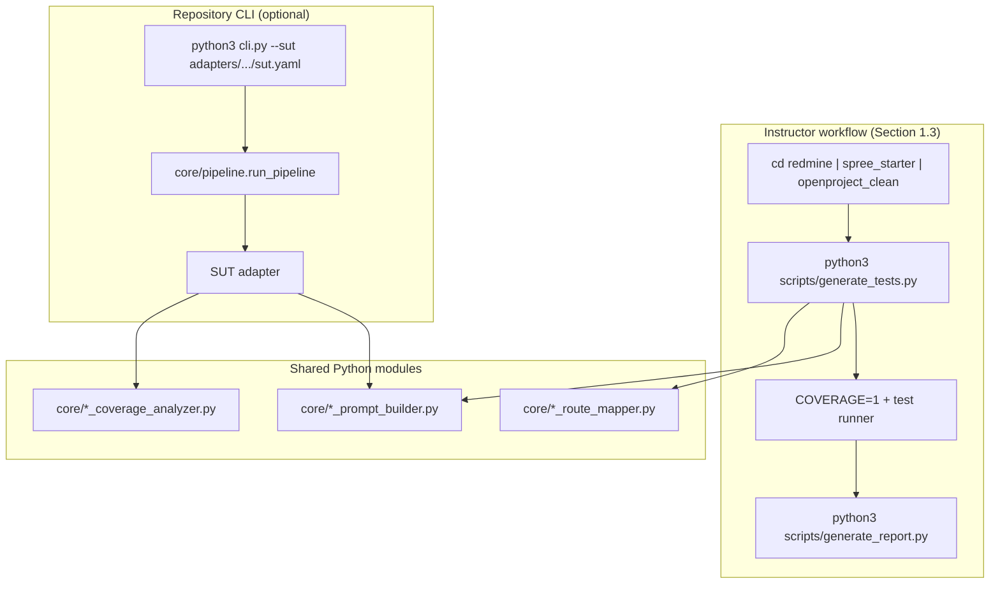
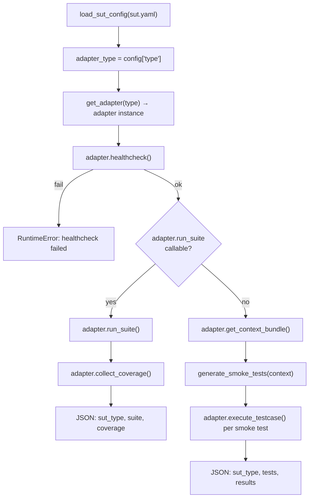
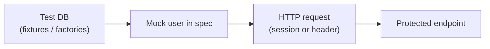
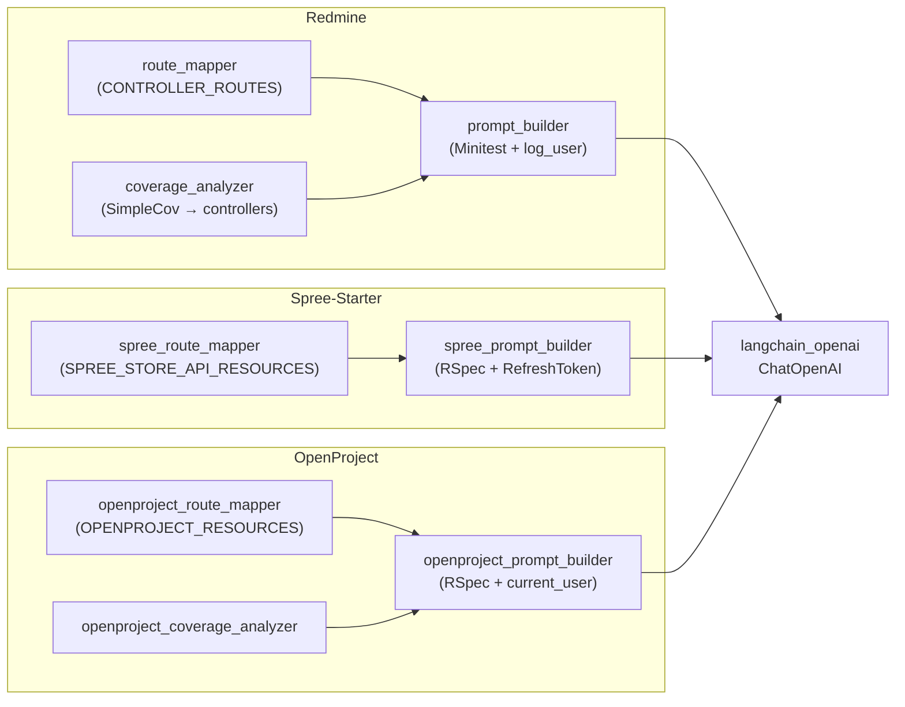
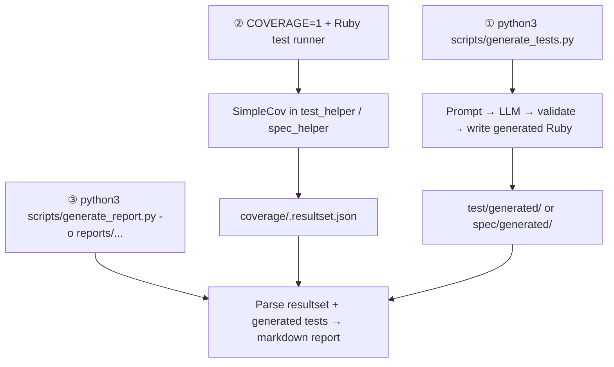

# ENS 491-2 — Automated Test Case Generation

# 1. Requirements to Successfully Generate Tests

The sections below describe what we need in order to generate tests, run them with coverage, and produce a report. The same command sequence is used for every application; only the working directory and output paths differ.

## 1.1 Prerequisites & Dependencies

The items in this section need to be in place before any test generation is attempted.

### 1.1.1 System prerequisites


| Tool                    | Purpose                                              |
| ----------------------- | ---------------------------------------------------- |
| **Python 3.10+**        | Run `generate_tests.py` and `generate_report.py`     |
| **rbenv** (recommended) | Install and switch Ruby versions per application     |
| **Bundler**             | Install Ruby gems (`bundle install`)                 |
| **PostgreSQL**          | Required for Spree-Starter and OpenProject (test DB) |
| **OpenAI API key**      | LLM test generation                                  |


We may also use **Redis** for Spree background jobs; it is not required when running only the generated request specs.

### 1.1.2 Repository layout

We need to work from the repository root so that shared modules and the environment file resolve correctly. In the examples below, this path is referred to as `REPO_ROOT`:

```bash
cd /path/to/ENS-491-2
export REPO_ROOT="$(pwd)"
```

The repository is expected to contain:

- `redmine/` — Redmine application
- `spree_starter/` — Spree Commerce starter
- `openproject_clean/` — OpenProject application
- `core/` — shared prompt and coverage logic
- `.env` — API key (see below; not committed to Git)

### 1.1.3 Environment file (`.env`)

We need a `.env` file at `REPO_ROOT/.env` (git-ignored) so that the generation scripts can call the OpenAI API:

```env
OPENAI_API_KEY=your_openai_api_key_here
```

The scripts use `python-dotenv` and discover this file when Python is run from an application subdirectory (for example `redmine/`), as long as `.env` exists at the repository root.

To confirm that the key is available:

```bash
cd "$REPO_ROOT/redmine"
python3 -c "from dotenv import load_dotenv; import os; load_dotenv(); print('OK' if os.getenv('OPENAI_API_KEY') else 'MISSING')"
```

### 1.1.4 Python dependencies

We need the following Python packages installed once at the repository root so that all three generators can run:

```bash
cd "$REPO_ROOT"
python3 -m pip install --upgrade pip
python3 -m pip install python-dotenv langchain-openai
```

All generators use **gpt-4.1-mini** by default.

### 1.1.5 Ruby, Rails, and Bundler versions

We need a separate Ruby version per application, as specified in each app’s `.ruby-version` file:


| Application       | `.ruby-version` | `Gemfile` constraint         | `Gemfile.lock` (resolved) | Bundler (`Gemfile.lock`) | Rails        |
| ----------------- | --------------- | ---------------------------- | ------------------------- | ------------------------ | ------------ |
| **Redmine**       | `3.2.3`         | `>= 2.7.0`, `< 3.3.0`        | Ruby **3.1.7**            | **2.6.9**                | **6.1.7.7**  |
| **Spree-Starter** | `3.4.1`         | `ruby file: '.ruby-version'` | Ruby **3.4.1**            | **4.0.3**                | **8.1.3**    |
| **OpenProject**   | `4.0.2`         | reads `.ruby-version`        | Ruby **4.0.2**            | **4.0.9**                | **~> 8.1.3** |


For Redmine, we align with Ruby **3.2.3** from `.ruby-version`. The lockfile was last resolved with 3.1.7; if `bundle install` fails, we adjust Ruby to 3.2.3 before considering a `bundle update`.

Example rbenv installation:

```bash
rbenv install 3.2.3
rbenv install 3.4.1
rbenv install 4.0.2

gem install bundler -v 2.6.9   # Redmine
gem install bundler -v 4.0.3   # Spree-Starter
gem install bundler -v 4.0.9   # OpenProject
```

### 1.1.6 Database configuration

#### Redmine — SQLite (default)

`redmine/config/database.yml` uses SQLite for the `test` environment, so no separate database server is required. The test database file is `redmine/db/redmine_test.sqlite3`.

#### Spree-Starter — PostgreSQL

We need PostgreSQL running and a user that can create databases. Connection settings can be set in `spree_starter/config/database.yml` or via environment variables:

```bash
export DATABASE_USERNAME=postgres
export DATABASE_HOST=localhost
export DATABASE_PORT=5432
```

#### OpenProject — PostgreSQL

We need PostgreSQL running and the `test` section of `openproject_clean/config/database.yml` updated with a valid local role:

```yaml
test:
  adapter: postgresql
  encoding: unicode
  database: openproject_test
  pool: 5
  username: YOUR_PG_USERNAME
  password: YOUR_PG_PASSWORD
```

---

## 1.2 One-time setup (per application)

Each application needs a one-time Ruby and test-database setup so that generated tests can be executed. We use a separate terminal session per app so that `rbenv local` applies the correct Ruby version.

### 1.2.1 Redmine

```bash
cd "$REPO_ROOT/redmine"
rbenv local 3.2.3
gem install bundler -v 2.6.9
bundle _2.6.9_ install

RAILS_ENV=test bundle exec rake db:migrate
RAILS_ENV=test bundle exec rake redmine:load_default_data REDMINE_LANG=en
```

### 1.2.2 Spree-Starter

```bash
cd "$REPO_ROOT/spree_starter"
rbenv local 3.4.1
gem install bundler -v 4.0.3
bundle _4.0.3_ install

RAILS_ENV=test bundle exec rails db:create db:migrate
RAILS_ENV=test bundle exec rails db:seed
```

Alternatively, from `spree_starter/`:

```bash
bin/setup
```

### 1.2.3 OpenProject

```bash
cd "$REPO_ROOT/openproject_clean"
rbenv local 4.0.2
gem install bundler -v 4.0.9
bundle _4.0.9_ install

RAILS_ENV=test bundle exec rails db:create db:migrate
```

The first `bundle install` and `db:migrate` for OpenProject may take several minutes.

---

## 1.3 Generating tests, measuring coverage, and generating a report

For every application we follow the same three steps from that application’s directory:

1. **Generate tests** — `python3 scripts/generate_tests.py`
2. **Measure coverage** — run the generated suite with `COVERAGE=1` (command depends on the test framework)
3. **Generate a report** — `python3 scripts/generate_report.py -o reports/<app>_report.md`

This assumes:

- `.env` at `REPO_ROOT` contains a valid `OPENAI_API_KEY`
- One-time setup from **Section 1.2** is complete for that application
- Commands are run from the application directory (`redmine/`, `spree_starter/`, or `openproject_clean/`)

### Application-specific paths and commands


| Application       | Working directory              | Generated test file                                    | Coverage command                                                                    | Report output                   |
| ----------------- | ------------------------------ | ------------------------------------------------------ | ----------------------------------------------------------------------------------- | ------------------------------- |
| **Redmine**       | `$REPO_ROOT/redmine`           | `test/generated/generated_suite_test.rb`               | `COVERAGE=1 bundle exec ruby -Itest test/generated/generated_suite_test.rb`         | `reports/redmine_report.md`     |
| **Spree-Starter** | `$REPO_ROOT/spree_starter`     | `spec/generated/store_api_spec.rb`                     | `COVERAGE=1 bundle exec rspec spec/generated/store_api_spec.rb`                     | `reports/spree_report.md`       |
| **OpenProject**   | `$REPO_ROOT/openproject_clean` | `spec/generated/openproject_generated_request_spec.rb` | `COVERAGE=1 bundle exec rspec spec/generated/openproject_generated_request_spec.rb` | `reports/openproject_report.md` |


After a coverage run, SimpleCov writes `coverage/.resultset.json` under the application directory. Redmine also provides `coverage/index.html` for browsing in a browser.

**Authentication in generated Spree tests:** authenticated Store API examples use `Spree::RefreshToken` and an `Authorization: Bearer` header via `auth_headers` (see `core/spree_prompt_builder.py`).

### Standard command sequence (example: Redmine)

The file names and the directories are the same for every subject application, hence copying this path will execute the same sequence of instructions for all of the applications. Changing the application name in cd command will be enough. 

```bash
cd "$REPO_ROOT/redmine"
python3 scripts/generate_tests.py
COVERAGE=1 bundle exec ruby -Itest test/generated/generated_suite_test.rb
python3 scripts/generate_report.py -o reports/redmine_report.md
```

The same pattern applies to Spree-Starter and OpenProject by changing the directory and substituting the coverage command and report path from the table above.

---

# 2. System Architecture & How the Test Case Generation is Handled

We document how a command reaches the LLM prompt. Section 1.3 uses the **application scripts** path; `cli.py` is an optional wrapper around the same generation logic for Redmine and OpenProject.

## 2.1 Where commands go




| Entry                             | Redirects to                                                   | Used in Section 1?       |
| --------------------------------- | -------------------------------------------------------------- | ------------------------ |
| `<app>/scripts/generate_tests.py` | `core` route map → prompt builder → OpenAI                     | **Yes** (all three apps) |
| `cli.py --sut <yaml>`             | `core/pipeline.py` → adapter → often `generate_tests.py` again | No (optional)            |


**Spree-Starter** has no entry in `adapters/`; it only follows the first row. **Redmine** and **OpenProject** support both rows via `adapters/redmine/sut.yaml` and `adapters/openproject/sut.yaml`.

## 2.2 Pipeline before the prompt (`cli.py` path)

When we use `python3 cli.py --sut adapters/<app>/sut.yaml`, `run_pipeline` in `core/pipeline.py` loads the YAML, picks the adapter by `type`, and runs a health check. After that, control either goes to full test generation or to a lightweight smoke-test stub.




For **Redmine** and **OpenProject**, `run_suite()` calls that app’s `scripts/generate_tests.py` (same path as Section 1.3), then runs the Ruby suite with `COVERAGE=1`. That is where we join the prompt-building flow below. The `no` branch is a placeholder and does not produce our main generated suites.

## 2.3 Authentication before the prompt

Protected routes and API endpoints need an authenticated principal in the **generated Ruby tests**, not in the Python pipeline itself. We therefore encode authentication in the prompt so the LLM emits tests that use **mock users from the test database** (fixtures or FactoryBot), which is enough to exercise auth-gated code paths without manual login during generation.




| Application       | Mock user          | How the generated test authenticates                               | Where it is defined                  |
| ----------------- | ------------------ | ------------------------------------------------------------------ | ------------------------------------ |
| **Redmine**       | `admin` (fixtures) | `log_user('admin', 'admin')` — posts to `/login`, sets session     | `redmine/test/test_helper.rb`        |
| **Spree-Starter** | `create(:user)`    | `Spree::RefreshToken.create!(user: …)` → `Authorization: Bearer …` | Top of generated `store_api_spec.rb` |
| **OpenProject**   | `create(:admin)`   | `let(:current_user) { create(:admin) }` on request specs           | `core/openproject_prompt_builder.py` |


We do **not** call live OAuth or browser login inside `generate_tests.py`; authentication is a **test-time concern** baked into the Ruby output. The route maps mark which endpoints need auth (`requires_auth` / `(authenticated)` / `(needs log_user)`), and the prompt builder turns that into concrete Ruby helpers.

## 2.4 Building the prompt

Regardless of entry point, `generate_tests.py` assembles the prompt in this order: **route map** (what to test, including auth flags) → **coverage snapshot** (what to prioritize, when available) → **prompt builder** (output format + authentication rules) → **LLM**.




| Application   | Coverage shapes the default prompt?              |
| ------------- | ------------------------------------------------ |
| Redmine       | Yes — low-coverage **controllers**               |
| Spree-Starter | No — static Store API catalog                    |
| OpenProject   | Yes — low-coverage **files** (controllers + API) |


Each prompt template (`core/prompt_builder.py`, `core/spree_prompt_builder.py`, `core/openproject_prompt_builder.py`) adds the same kind of rules on top of the endpoint list. The points below are the ones that matter most for successful generation.

### Redmine (`core/prompt_builder.py`)

- **Session login:** routes marked `(needs log_user)` must call `log_user('admin', 'admin')` before the request.
- **Anonymous vs authenticated:** we ask for both public routes and admin routes so permission branches are hit.
- **Stable assertions:** after redirects, only assert HTML when the response is actually HTML; allow `[200, 403, 404]` (and `406` for XHR).

### Spree-Starter (`core/spree_prompt_builder.py`)

- **Bearer token:** `(authenticated)` Store API calls must use `auth_headers` built from `Spree::RefreshToken`, not plain `headers`.
- **Factory user:** `let(:user) { create(:user, …) }` at the top of the spec; no Doorkeeper/OAuth flow in tests.
- **One example per resource:** the prompt lists all safe Store API resources so cart, account, and checkout are not skipped.

### OpenProject (`core/openproject_prompt_builder.py`)

- **Request spec user:** `(authenticated)` endpoints use `current_user { create(:admin) }`; public endpoints stay unauthenticated.
- **Branch pairs:** for many API routes we ask for both authenticated and anonymous examples (including `301`/`302` where redirects apply).
- **Deterministic seeds:** use fixture-style `let!` helpers (`seed_project`, `seed_user`, …) instead of hard-coded IDs.

After the LLM responds, each `generate_tests.py` validates the Ruby and writes one file under that app’s `test/generated` or `spec/generated` folder (see Section 1.3).

---

## 2.5 After the prompt — execution, files, and coverage

Section 1.3 runs three commands per application. Below is what each step executes, which files are involved, and how coverage is collected and interpreted.

### What runs after the Section 1.3 commands




| Step           | What runs                                                                                               | Main output                                                                                |
| -------------- | ------------------------------------------------------------------------------------------------------- | ------------------------------------------------------------------------------------------ |
| **① Generate** | Python loads `.env`, builds prompt from `core/`, calls OpenAI, checks Ruby shape, writes one suite file | `generated_suite_test.rb` or `store_api_spec.rb` / `openproject_generated_request_spec.rb` |
| **② Coverage** | Rails test stack executes the generated file; SimpleCov records line hits                               | `coverage/.resultset.json` (and `coverage/index.html` on Redmine)                          |
| **③ Report**   | Python reads `.resultset.json`, parses the generated file, compares routes vs tests, writes markdown    | `reports/<app>_report.md`                                                                  |


OpenProject additionally applies `normalize_generated_code()` in `generate_tests.py` (syntax/status fixes) before validation. That step exists only on OpenProject.

### Relevant files and roles

#### Repository root


| File               | Role                                                                        |
| ------------------ | --------------------------------------------------------------------------- |
| `.env`             | Supplies `OPENAI_API_KEY` to generation scripts                             |
| `cli.py`           | Optional entry: `--sut` → `core/pipeline.py` (not used in Section 1.3)      |
| `core/pipeline.py` | Loads `sut.yaml`, selects adapter, may call `generate_tests.py` via adapter |


#### Shared `core/` (per application)


| File                                    | Role                                                                   |
| --------------------------------------- | ---------------------------------------------------------------------- |
| `core/route_mapper.py`                  | Redmine controller routes and auth flags                               |
| `core/prompt_builder.py`                | Redmine LLM prompt + coverage-aware controller list                    |
| `core/coverage_analyzer.py`             | Reads Redmine `coverage/.resultset.json`; prioritizes **controllers**  |
| `core/spree_route_mapper.py`            | Spree Store API endpoint catalog                                       |
| `core/spree_prompt_builder.py`          | Spree RSpec prompt + Bearer auth template                              |
| `core/openproject_route_mapper.py`      | OpenProject resources, endpoints, coverage target paths                |
| `core/openproject_prompt_builder.py`    | OpenProject RSpec prompt + `current_user` rules                        |
| `core/openproject_coverage_analyzer.py` | Reads OpenProject resultset; prioritizes **controllers and API files** |


#### Adapters (optional `cli.py` path only)


| File                              | Role                                                                   |
| --------------------------------- | ---------------------------------------------------------------------- |
| `adapters/base.py`                | `SUTAdapter` interface (`healthcheck`, `collect_coverage`, …)          |
| `adapters/registry.py`            | Maps `sut.yaml` `type` → adapter class                                 |
| `adapters/redmine/adapter.py`     | Redmine healthcheck; can subprocess `generate_tests.py` + `rails test` |
| `adapters/redmine/sut.yaml`       | Redmine `base_url`, auth metadata                                      |
| `adapters/openproject/adapter.py` | OpenProject healthcheck; can subprocess `generate_tests.py` + `rspec`  |
| `adapters/openproject/sut.yaml`   | `project_dir`, test commands, coverage path hints                      |


Spree-Starter has no adapter; it uses only `spree_starter/scripts/` and `core/spree_*`.

#### Per-application scripts (Section 1.3)


| File                                | Role                                                        |
| ----------------------------------- | ----------------------------------------------------------- |
| `<app>/scripts/generate_tests.py`   | CLI for step ①: prompt, LLM, validate, write generated Ruby |
| `<app>/scripts/generate_report.py`  | CLI for step ③: coverage + test analysis → report           |
| `redmine/scripts/print_coverage.rb` | Optional: prints overall % from `.resultset.json`           |


#### Ruby test harness (step ②)


| File                                    | Role                                                                    |
| --------------------------------------- | ----------------------------------------------------------------------- |
| `redmine/test/test_helper.rb`           | Starts SimpleCov when `COVERAGE=1`; defines `log_user` for session auth |
| `openproject_clean/spec/spec_helper.rb` | Starts SimpleCov when `COVERAGE=1`                                      |
| `spree_starter/spec/rails_helper.rb`    | Loads Rails + RSpec for generated request specs                         |


#### Generated artifacts


| Path                                                                     | Role                                                      |
| ------------------------------------------------------------------------ | --------------------------------------------------------- |
| `redmine/test/generated/generated_suite_test.rb`                         | LLM-produced Minitest integration suite                   |
| `spree_starter/spec/generated/store_api_spec.rb`                         | LLM-produced Store API request spec                       |
| `openproject_clean/spec/generated/openproject_generated_request_spec.rb` | LLM-produced OpenProject request spec                     |
| `<app>/coverage/.resultset.json`                                         | SimpleCov line coverage (input for analyzers and reports) |
| `<app>/reports/*_report.md`                                              | Human-readable summary from step ③                        |


### How we obtain coverage data

Coverage is **not** computed in Python during the test run. We rely on **SimpleCov inside Ruby**:

1. Step ② sets `COVERAGE=1`, which triggers SimpleCov in `test_helper.rb` or `spec_helper.rb` before Rails loads.
2. Each executed line in the app under test is recorded while the generated suite runs.
3. At exit, SimpleCov writes `**coverage/.resultset.json`** (per-file line hit maps).

Python reads that JSON **after** the run. Nothing in step ① needs a prior coverage file; Redmine and OpenProject can **use** an existing resultset when building the *next* prompt (low-coverage targets), but Section 1.3 step ② must have run at least once for reports to show real numbers.

### How we analyze and use coverage


| Stage                                 | Mechanism                                                                                                     | Comment                                                                                                                                                                                     |
| ------------------------------------- | ------------------------------------------------------------------------------------------------------------- | ------------------------------------------------------------------------------------------------------------------------------------------------------------------------------------------- |
| **Prioritization** (next generation)  | `priority_score ≈ 0.7 × (100 − coverage%) + 0.3 × min(lines/300, 1)`                                          | Favors **large, under-covered** areas (Redmine controllers; OpenProject controllers + API representers). Spree’s default prompt does not use this for generation—only the static route map. |
| **Labels**                            | `CRITICAL` / `HIGH` / `MEDIUM` / `LOW` / `SKIP` from coverage % and file size                                 | Surfaces what to target in reports and in Redmine/OpenProject focused prompts.                                                                                                              |
| **Report: line coverage**             | `CoverageAnalyzer` or `OpenProjectCoverageAnalyzer`, or inline parsing in Spree’s `generate_report.py`        | Overall % and per-target breakdown from `.resultset.json`.                                                                                                                                  |
| **Report: endpoint / route coverage** | `generate_report.py` parses `describe` / `test` blocks and matches paths to `route_mapper` / `*_route_mapper` | Shows which catalogued routes appear in generated tests (especially important for Spree and OpenProject API coverage).                                                                      |
| **Report: gaps**                      | Compares catalog vs generated tests (and low line coverage where applicable)                                  | Lists resources or controllers still weakly tested.                                                                                                                                         |


